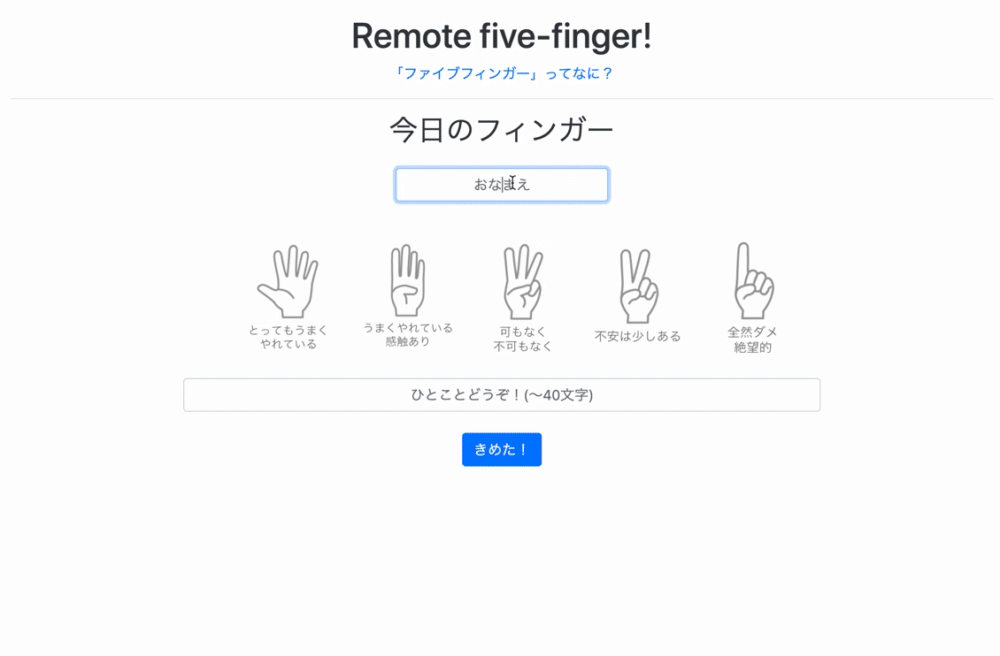

# remote-five-finger

「『せーの、どん！』でチームのいまを知る」  
  
[カイゼン・ジャーニー](https://kaizenjourney.jp/) で紹介されているプラクティス「ファイブフィンガー」を気軽にリモートで実施するためのオンラインツールです。  



## Demo

[https://remote-five-finger.uc.r.appspot.com/](https://remote-five-finger.uc.r.appspot.com/)  
※予告なく停止することがあります  

1. [ファシリテーター向けページ](https://remote-five-finger.uc.r.appspot.com/facilitator-console) を開きます
2. 1のページを開いたまま、 [メンバー向けページ](https://remote-five-finger.uc.r.appspot.com/front) を開きます
3. 各項目を入力して「きめた！」ボタンを押します
4. 1で開いていたファシリテーター向けページに、メンバー向けページの入力内容が表示されます
5. ファシリテーター向けページで「公開する」ボタンを押します
6. メンバー向けページが入力画面から発表画面に切り替わります
7. 終わったら、ファシリテーター向けページの「初期化する」ボタンを押して内容をクリアします

## Overview

- Dockerfileを含んでいますので、ビルドしてGKEなどに上げれば自分のチーム用の環境がすぐできます
  - `n1-standard-1`で充分です。  

- アプリ化するにあたって以下の点を工夫しています
  - お手軽さの重視：名前を書いて指を選べばそれでOK、ひとこともあえて短く制限
  - 「せーの、どん！」の重視：入力時点で他メンバーが見えない(空気読みをしない)
  - どん！の一覧性：12人くらいまでならMBPのディスプレイで1画面に収まる(はず)
  - リアルタイム性：リロードなしで入力→結果に切り替え


## Known Issue

- セッション管理や状態の保存を行っていないので、送信後にリロードするともう一度入力・送信できます
- JSアプリケーションはローカルDBとpub/subしているため、1台構成で動かす必要があります
  - GKEなどに上げる場合、podが複数になるとチームメンバーの投稿先が分散してしまい、どん！で全員揃わなくなることがあります
- ひとまず1チームでの使用を前提として作ったので、同じプロセスを同時に使うと混ざります
- 日本語です(READMEだけちょっと英語ですが)

## Table Of Contents

- [remote-five-finger](#remote-five-finger)
  - [Demo](#demo)
  - [Overview](#overview)
  - [Known Issue](#known-issue)
  - [Table Of Contents](#table-of-contents)
  - [Setup](#setup)
    - [A. Docker](#a-docker)
    - [B. step-by-step](#b-step-by-step)
  - [Usage](#usage)
    - [for member](#for-member)
    - [for facilitator](#for-facilitator)

## Setup

### A. Docker

```sh
git clone https://github.com/kamehiro17/remote-five-finger.git
cd remote-five-finger
docker build -t rff
docker run --d -p 8888:3000 rff
```

### B. step-by-step

1. get & install [meteor](https://www.meteor.com/install)  (works on 1.10)
2. clone [this repository](https://github.com/kamehiro17/remote-five-finger.git)
3. install dependencies

```sh
cd remote-five-finger
meteor npm install
```

4. run

```sh
meteor --port 8888
```

## Usage

### for member

[http://localhost:8888/front](http://localhost:8888/front)

1. Enter your name (required) .
2. Choose today's finger (how is it going on?) .
3. Add short message and hit button.
4. When facilitator announced, your screen will be transitions to today's result.

### for facilitator

[http://localhost:8888/facilitator-console](http://localhost:8888/facilitator-console)

1. Announce URL (`/front`) to members.
2. Members' submitted contents will appears in your screen. Don't forget, you also raise your finger.
3. When all of members finished input, click the publish button.
4. View published today's result and let's have conversation to improve your team!
5. Finally, click the initialize button to re-enable input. 

WARNING: Initialize button will **deletes all data and you cannot see previous data.** You can copy comma-separated result data and paste it to your local/shared document to retrospect.


